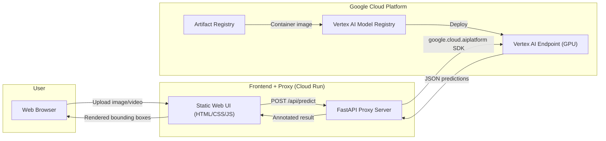

# End-to-End Deployment: YOLO TensorRT on Vertex AI with Web UI

## Background & Goal

Deploy a pre-trained **YOLO26m** object detection model (compiled as `best.engine` — a ~92MB TensorRT engine) on **Google Cloud Vertex AI** (project: `n8n11-470807`) via a custom serving container, and build a **premium web dashboard** deployed on **Cloud Run** that lets users upload images/videos, run inference through the Vertex AI endpoint, and see annotated results with bounding boxes, labels, and confidence scores.

**Model Details:**
- **Architecture**: YOLO26m (Ultralytics)
- **Custom Classes** (4): `accident`, `bus`, `car`, `truck`
- **Format**: TensorRT engine (`best.engine`, ~92MB)
- **Original weights**: Not available — the `.engine` file is the only artifact

---

## Architecture Overview



### Data Flow

1. **User** uploads an image or video through the Web UI
2. **Frontend** sends the media (base64-encoded) to the **Proxy Server**
3. **Proxy** forwards the payload to the **Vertex AI Endpoint** using the official Python SDK
4. **Vertex AI** runs the `best.engine` model and returns structured JSON (bounding boxes, classes, confidences)
5. **Proxy** returns predictions to the frontend
6. **Frontend** renders bounding boxes and labels over the original image/video using HTML5 Canvas

---

## Confirmed Configuration

| Parameter | Value |
|---|---|
| **GCP Project ID** | `n8n11-470807` |
| **Region** | `us-central1` |
| **YOLO Version** | YOLO26m (Ultralytics) |
| **Custom Classes** | `accident`, `bus`, `car`, `truck` (4 classes) |
| **Original Weights** | Not available (engine-only) |
| **Frontend Hosting** | Google Cloud Run |
| **Vertex AI Scaling** | `min_replica_count=0` (scale-to-zero), `max_replica_count=3` |
| **GPU** | NVIDIA Tesla T4 (1x) |
| **Machine Type** | `n1-standard-4` |

> [!IMPORTANT]
> **Prerequisites** — ensure these are ready before execution:
> - GCP project `n8n11-470807` with billing enabled
> - `gcloud` CLI installed and authenticated (`gcloud auth login`)
> - Sufficient GPU quota in `us-central1` for at least 1x NVIDIA T4
> - Docker installed locally (for building the container image)

> [!WARNING]
> **TensorRT Engine Risk**: Since no original `best.pt` weights are available, the `best.engine` file **must** be compatible with the Ultralytics runtime in the container. If a deserialization error occurs on the T4 GPU, we will need to obtain the original `.pt` file to re-export. The deployment scripts include a local test step to catch this early.

> [!NOTE]
> **Cost**: Scale-to-zero (`min_replica_count=0`) means **$0 when idle**, but the first request after idle incurs ~5–10 min cold-start. Subsequent requests are fast (~200ms).

---

## Technical Stack

| Component | Technology | Rationale |
|---|---|---|
| **Inference Server** | FastAPI + Uvicorn | Async, lightweight, native JSON schema validation |
| **Model Runtime** | Ultralytics (YOLO) + TensorRT | Seamlessly loads `.engine` files, handles pre/post-processing |
| **Base Docker Image** | `ultralytics/ultralytics:latest` | Pre-configured CUDA 12.8 + cuDNN 9 + TensorRT + Ultralytics |
| **Container Registry** | Google Artifact Registry | GCP-native, integrates with Vertex AI |
| **Model Serving** | Vertex AI Custom Container Prediction | GPU-accelerated endpoints with autoscaling |
| **Frontend** | Vanilla HTML/CSS/JS + HTML5 Canvas | No build step, maximum performance, premium design |
| **Frontend Proxy** | FastAPI (Python) | Securely bridges frontend ↔ Vertex AI using service account |
| **Video Processing** | OpenCV (server-side frame extraction) | Reliable frame-by-frame extraction and re-encoding |

---

## Proposed Changes

### Component 1: Inference Server (Custom Container for Vertex AI)

This is the core model-serving container that Vertex AI will run. It loads `best.engine` and exposes the required HTTP endpoints.

---

#### [NEW] [server/app.py](file:///c:/Users/Ameer/YOLO_Deploy/server/app.py)

FastAPI inference server with two endpoints:

- **`GET /health`** — Returns `{"status": "healthy"}` with 200. Vertex AI calls this for liveness/readiness checks.
- **`POST /predict`** — Accepts JSON with base64-encoded image(s). Returns structured predictions.

**Key implementation details:**
```python
# Custom class names for the YOLO26m model
CLASS_NAMES = {0: "accident", 1: "bus", 2: "car", 3: "truck"}

# Startup: Load model once into GPU memory
model = YOLO("/app/best.engine")

# /predict endpoint:
# 1. Decode base64 image → numpy array (cv2.imdecode)
# 2. Run model.predict(img, conf=0.25)
# 3. Extract from results: boxes.xyxy, boxes.conf, boxes.cls
# 4. Map class IDs to names using CLASS_NAMES
# 5. Return JSON: {"predictions": [{"boxes": [...], "labels": [...], "scores": [...]}]}
```

**Request format (Vertex AI standard):**
```json
{
  "instances": [
    {"image_base64": "<base64-encoded-image>"}
  ]
}
```

**Response format:**
```json
{
  "predictions": [
    {
      "boxes": [[x1, y1, x2, y2], ...],
      "labels": ["accident", "bus", "car", "truck"],
      "scores": [0.95, 0.87, ...],
      "image_width": 1920,
      "image_height": 1080
    }
  ]
}
```

---

#### [NEW] [server/requirements.txt](file:///c:/Users/Ameer/YOLO_Deploy/server/requirements.txt)

```
fastapi>=0.110.0
uvicorn[standard]>=0.29.0
python-multipart>=0.0.9
numpy>=1.24.0
opencv-python-headless>=4.8.0
Pillow>=10.0.0
```

> [!NOTE]
> `ultralytics` and `tensorrt` are pre-installed in the base Docker image. We only add the web server dependencies.

---

#### [NEW] [server/Dockerfile](file:///c:/Users/Ameer/YOLO_Deploy/server/Dockerfile)

```dockerfile
FROM ultralytics/ultralytics:latest

WORKDIR /app

# Install server dependencies
COPY requirements.txt .
RUN pip install --no-cache-dir -r requirements.txt

# Copy application code and model
COPY app.py .
COPY best.engine .

# Vertex AI sends requests to port defined by AIP_HTTP_PORT (default 8080)
ENV AIP_HTTP_PORT=8080
EXPOSE 8080

# Run the server
CMD ["uvicorn", "app:app", "--host", "0.0.0.0", "--port", "8080"]
```

**Optimization notes:**
- Using `ultralytics/ultralytics:latest` as base gives us CUDA 12.8, cuDNN 9, TensorRT, and Ultralytics pre-installed
- `best.engine` (~92MB) is baked into the image for fastest cold-start (no GCS download at startup)
- `opencv-python-headless` avoids pulling X11/GUI dependencies

---

### Component 2: GCP Deployment Scripts

Automation scripts for the entire cloud deployment pipeline.

---

#### [NEW] [deploy/setup_gcp.sh](file:///c:/Users/Ameer/YOLO_Deploy/deploy/setup_gcp.sh)

Shell script that orchestrates the full GCP setup:

1. **Enable APIs**: `artifactregistry`, `aiplatform`, `cloudbuild`
2. **Create Artifact Registry repo** (if not exists)
3. **Authenticate Docker** with `gcloud auth configure-docker`
4. **Build & push** the container image
5. **Upload model** to Vertex AI Model Registry
6. **Create endpoint** & **deploy model** with GPU accelerator

```bash
# Key commands (parameterized with env vars):
# PROJECT_ID, REGION, REPO_NAME, IMAGE_NAME, ENDPOINT_NAME

# Build
docker build -t ${REGION}-docker.pkg.dev/${PROJECT_ID}/${REPO_NAME}/${IMAGE_NAME}:latest ./server

# Push
docker push ${REGION}-docker.pkg.dev/${PROJECT_ID}/${REPO_NAME}/${IMAGE_NAME}:latest

# Upload model to Vertex AI
gcloud ai models upload \
  --region=${REGION} \
  --display-name="yolo-tensorrt" \
  --container-image-uri="${REGION}-docker.pkg.dev/${PROJECT_ID}/${REPO_NAME}/${IMAGE_NAME}:latest" \
  --container-health-route="/health" \
  --container-predict-route="/predict" \
  --container-ports=8080

# Create endpoint
gcloud ai endpoints create \
  --region=${REGION} \
  --display-name="${ENDPOINT_NAME}"

# Deploy model to endpoint with GPU
gcloud ai endpoints deploy-model ${ENDPOINT_ID} \
  --region=${REGION} \
  --model=${MODEL_ID} \
  --display-name="yolo-tensorrt-deployed" \
  --machine-type=n1-standard-4 \
  --accelerator=type=nvidia-tesla-t4,count=1 \
  --min-replica-count=0 \
  --max-replica-count=3
```

---

#### [NEW] [deploy/deploy_vertex.py](file:///c:/Users/Ameer/YOLO_Deploy/deploy/deploy_vertex.py)

Python alternative using the `google-cloud-aiplatform` SDK for programmatic deployment:

- `upload_model()` — Registers the custom container as a Vertex AI Model
- `create_endpoint()` — Creates a Vertex AI Endpoint
- `deploy_model()` — Deploys the model to the endpoint with T4 GPU
- `test_endpoint()` — Sends a test image and verifies response

This provides better error handling and output parsing than the shell script.

---

#### [NEW] [deploy/.env.example](file:///c:/Users/Ameer/YOLO_Deploy/deploy/.env.example)

Template for required environment variables:
```
GCP_PROJECT_ID=n8n11-470807
GCP_REGION=us-central1
ARTIFACT_REPO=yolo-deploy
IMAGE_NAME=yolo-tensorrt-server
ENDPOINT_NAME=yolo-endpoint
GOOGLE_APPLICATION_CREDENTIALS=/path/to/service-account-key.json
```

---

### Component 3: Frontend Proxy Server (Cloud Run)

A secure backend deployed on **Cloud Run** that bridges the web UI with the Vertex AI endpoint. Serves both the static frontend files and the API proxy.

---

#### [NEW] [frontend/proxy/server.py](file:///c:/Users/Ameer/YOLO_Deploy/frontend/proxy/server.py)

FastAPI proxy server that:

1. **Serves static files** (the web UI HTML/CSS/JS)
2. **`POST /api/predict`** — Accepts multipart image/video uploads from the frontend
   - For images: Encodes to base64, calls Vertex AI, returns predictions
   - For videos: Extracts frames with OpenCV, batches them to Vertex AI, returns per-frame predictions
3. **`POST /api/predict/video`** — Dedicated video processing endpoint
   - Extracts frames at configurable FPS (default: every 5th frame for performance)
   - Calls Vertex AI for each frame batch
   - Returns a JSON array of per-frame detections
4. Uses `google.cloud.aiplatform` SDK with Application Default Credentials (ADC)
5. Configured for deployment on **Cloud Run** (Dockerfile included)

---

#### [NEW] [frontend/Dockerfile](file:///c:/Users/Ameer/YOLO_Deploy/frontend/Dockerfile)

Container for the frontend proxy, deployable to Cloud Run:

```dockerfile
FROM python:3.11-slim

WORKDIR /app

COPY proxy/requirements.txt .
RUN pip install --no-cache-dir -r requirements.txt

COPY proxy/ ./proxy/
COPY static/ ./static/

ENV PORT=8080
EXPOSE 8080

CMD ["uvicorn", "proxy.server:app", "--host", "0.0.0.0", "--port", "8080"]
```

---

#### [NEW] [deploy/deploy_cloudrun.sh](file:///c:/Users/Ameer/YOLO_Deploy/deploy/deploy_cloudrun.sh)

Deploys the frontend proxy to Cloud Run:

```bash
# Build and deploy to Cloud Run
gcloud run deploy yolo-frontend \
  --source=./frontend \
  --project=n8n11-470807 \
  --region=us-central1 \
  --allow-unauthenticated \
  --set-env-vars="GCP_PROJECT_ID=n8n11-470807,GCP_REGION=us-central1,VERTEX_ENDPOINT_ID=<endpoint-id>" \
  --memory=1Gi \
  --cpu=1
```

---

#### [NEW] [frontend/proxy/requirements.txt](file:///c:/Users/Ameer/YOLO_Deploy/frontend/proxy/requirements.txt)

```
fastapi>=0.110.0
uvicorn[standard]>=0.29.0
python-multipart>=0.0.9
google-cloud-aiplatform>=1.50.0
opencv-python-headless>=4.8.0
numpy>=1.24.0
Pillow>=10.0.0
python-dotenv>=1.0.0
```

---

### Component 4: Web UI (The Frontend)

A premium, modern single-page web dashboard for **vehicle & accident detection**. No frameworks, no build step — pure HTML/CSS/JS for maximum performance. Tailored to the 4-class model: accident, bus, car, truck.

---

#### [NEW] [frontend/static/index.html](file:///c:/Users/Ameer/YOLO_Deploy/frontend/static/index.html)

Main page structure:

- **Header**: App title + logo, model status indicator (green/red)
- **Upload Zone**: Large drag-and-drop area with file picker for PNG/JPG/MP4/AVI/MOV
- **Preview Panel**: Shows uploaded media before inference
- **Results Panel**: Canvas overlay for bounding boxes + detection statistics sidebar
- **Controls**: Confidence threshold slider, "Run Inference" button, download annotated result button
- **Footer**: Connection status, latency display

**Design language:**
- Dark mode with deep slate backgrounds (`hsl(222, 47%, 11%)`)
- Accent gradient: Electric blue → Purple (`#3B82F6` → `#8B5CF6`)
- Glassmorphism cards with `backdrop-filter: blur(16px)`
- Smooth micro-animations on all interactions
- Google Font: **Inter** for clean, modern typography

---

#### [NEW] [frontend/static/styles.css](file:///c:/Users/Ameer/YOLO_Deploy/frontend/static/styles.css)

Complete design system:

- **CSS Custom Properties** for the entire color palette, spacing, and typography
- **Dark mode by default** with carefully chosen contrast ratios
- **Glassmorphism cards**: Semi-transparent backgrounds + backdrop blur
- **Drag-and-drop zone**: Animated dashed border, pulse animation on hover, file type icons
- **Bounding box overlays**: Fixed color per class — `accident`: red, `bus`: amber, `car`: blue, `truck`: green
- **Detection stats sidebar**: Animated count-up numbers, colored class chips
- **Responsive layout**: CSS Grid with `auto-fit` for desktop/tablet/mobile
- **Micro-animations**: 
  - Upload zone pulse on drag-over
  - Fade-in for detection results
  - Slide-up for stat cards
  - Smooth progress bar for video processing
  - Skeleton loading states during inference

---

#### [NEW] [frontend/static/app.js](file:///c:/Users/Ameer/YOLO_Deploy/frontend/static/app.js)

Application logic (~400–500 lines):

**Media Upload:**
- Drag & drop handling with visual feedback
- File type validation (images: PNG, JPG, JPEG, WEBP; videos: MP4, AVI, MOV)
- File size validation (max 50MB)
- Image preview with `FileReader` + `URL.createObjectURL`
- Video preview with `<video>` element + thumbnail extraction

**Inference Flow:**
- `runInference(file)` → POST to `/api/predict` (multipart form)
- Loading state with animated spinner + progress indicator
- Latency measurement (`performance.now()`)
- Error handling with toast notifications

**Bounding Box Rendering (Images):**
- HTML5 `<canvas>` overlay positioned exactly over the preview image
- Dynamic scaling: maps model coordinates to displayed image dimensions
- Fixed color per class: `accident` → red `#EF4444`, `bus` → amber `#F59E0B`, `car` → blue `#3B82F6`, `truck` → green `#10B981`
- Draws: filled rectangle (10% opacity), solid border (2px), label badge with class name + confidence %
- Toggle visibility per class via sidebar checkboxes (accident/bus/car/truck)

**Video Processing:**
- Frame-by-frame playback with annotations
- Progress bar showing processing status
- Playback controls (play/pause, frame scrubber)
- Option to download annotated video (rendered client-side with `MediaRecorder` API)

**Statistics Panel:**
- Total detections count
- Per-class breakdown with colored chips
- Average confidence score
- Inference latency display

---

### Component 5: Documentation

---

#### [NEW] [README.md](file:///c:/Users/Ameer/YOLO_Deploy/README.md)

Comprehensive documentation covering:

1. **Project Overview** — What this project does
2. **Architecture Diagram** — Visual reference
3. **Prerequisites** — GCP project, gcloud CLI, Docker, Python 3.10+
4. **Quick Start** — Step-by-step from clone to running
5. **Deployment Guide** — Full GCP deployment walkthrough
6. **Environment Variables** — Reference table for all config
7. **API Reference** — Endpoint documentation with examples
8. **Troubleshooting** — Common issues and fixes
9. **Cost Management** — How to shut down/scale-down to avoid charges

---

## Project File Structure

```
YOLO_Deploy/
├── PRD.md                          # Product requirements (existing)
├── best.engine                     # TensorRT model (existing, ~92MB)
├── README.md                       # [NEW] Project documentation
│
├── server/                         # [NEW] Vertex AI serving container
│   ├── Dockerfile
│   ├── app.py                      # FastAPI inference server
│   └── requirements.txt
│
├── deploy/                         # [NEW] GCP deployment scripts
│   ├── setup_gcp.sh                # Shell-based Vertex AI deployment
│   ├── deploy_vertex.py            # Python SDK Vertex AI deployment
│   ├── deploy_cloudrun.sh          # Cloud Run frontend deployment
│   └── .env.example                # Environment variable template
│
└── frontend/                       # [NEW] Web UI + proxy (Cloud Run)
    ├── Dockerfile                  # Cloud Run container
    ├── proxy/
    │   ├── server.py               # FastAPI proxy to Vertex AI
    │   └── requirements.txt
    └── static/
        ├── index.html              # Main page
        ├── styles.css              # Design system
        └── app.js                  # Application logic
```

---

## Verification Plan

### Automated Tests

```bash
# 1. Local container test (requires Docker + NVIDIA runtime)
docker build -t yolo-test ./server
docker run --gpus all -p 8080:8080 yolo-test

# 2. Health check
curl http://localhost:8080/health
# Expected: {"status": "healthy"}

# 3. Prediction test with sample image
curl -X POST http://localhost:8080/predict \
  -H "Content-Type: application/json" \
  -d '{"instances": [{"image_base64": "<base64-of-test-image>"}]}'
# Expected: {"predictions": [{"boxes": [...], "labels": [...], "scores": [...]}]}
```

### Manual Verification

1. **Container Health**: Verify `/health` returns 200 both locally and after Vertex AI deployment
2. **Vertex AI Endpoint**: Use `gcloud ai endpoints predict` to send a test image and verify JSON response
3. **Frontend E2E**:
   - Upload a PNG image → verify bounding boxes render correctly
   - Upload a JPG image → verify correct scaling and label positioning
   - Upload an MP4 video → verify frame-by-frame processing and playback
   - Test drag-and-drop → verify visual feedback
   - Test confidence slider → verify boxes filter in real-time
   - Test on mobile viewport → verify responsive layout
4. **Cost Check**: Verify Vertex AI endpoint autoscaling settings in GCP Console

### Smoke Test Script

```bash
# [NEW] deploy/test_endpoint.py
# Automated test that:
# 1. Sends 3 different test images to the live Vertex AI endpoint
# 2. Validates response schema
# 3. Checks latency is < 2 seconds per image
# 4. Reports pass/fail
```

---

## Execution Order

| Step | Phase | Files | Estimated Effort |
|------|-------|-------|-----------------|
| 1 | Inference Server | `server/app.py`, `server/requirements.txt` | Core logic |
| 2 | Containerization | `server/Dockerfile` | Docker build |
| 3 | Deploy Scripts | `deploy/setup_gcp.sh`, `deploy/deploy_vertex.py`, `deploy/.env.example` | GCP automation |
| 4 | Frontend Proxy | `frontend/proxy/server.py`, `frontend/proxy/requirements.txt` | API bridge |
| 5 | Web UI | `frontend/static/index.html`, `styles.css`, `app.js` | Premium UI |
| 6 | Documentation | `README.md` | Docs |
| 7 | Verification | Local test → GCP deploy → E2E test | Testing |
